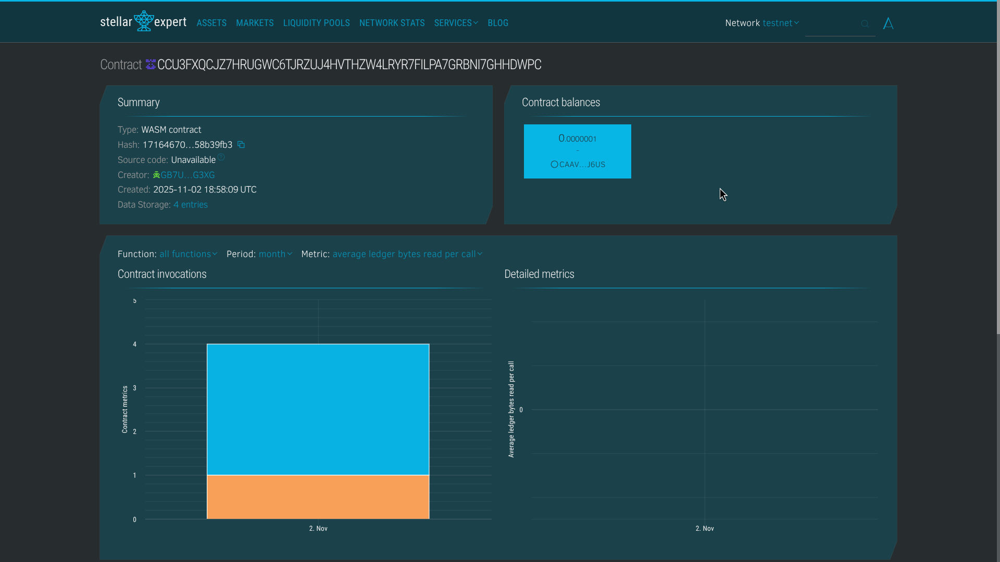

## Contract Details

- **Lottery Contract ID**: `CCU3FXQCJZ7HRUGWC6TJRZUJ4HVTHZW4LRYR7FILPA7GRBNI7GHHDWPC`
- **Payment Token ID**: `CAAVFG6T35KMPIFCSTLAQW7CF3JVIJLZ67H6VZ65EWKJT4RDNCQXJ6US`
- **Admin Address**: `GB7UYMD3K7CLHC374ZRZDAR5ORC55P7BIFTSZZT426GS6OQHVFP5G3XG`
  

# 🎰 NFT Lottery DApp - Stellar Soroban

<div align="center">


**A Decentralized NFT Lottery Platform Built on Stellar Blockchain**

[🌐 Live Demo](https://soroban-nft-lottery.vercel.app/) • [Documentation](#-contract-methods) • [Quick Start](#-quick-start-checklist)

</div>

---

## 📖 Project Title

**NFT Lottery DApp** - Decentralized NFT Prize Lottery System on Stellar

## 📝 Description

NFT Lottery DApp is a transparent, decentralized lottery platform built on the Stellar blockchain using Soroban smart contracts. The platform enables administrators to create lottery rounds with unique NFT prizes of varying rarity levels, while users can purchase tickets using Stellar tokens for a chance to win exclusive digital collectibles.

The system leverages blockchain technology to ensure:

- **Transparency**: All lottery data is stored on-chain and publicly verifiable
- **Fairness**: Random winner selection using blockchain-based randomness
- **Security**: Smart contract-enforced rules with no possibility of manipulation
- **Decentralization**: No central authority can alter lottery outcomes

### How It Works

1. **Admin** creates a lottery with NFT prize details (name, image, rarity)
2. **Users** purchase tickets using the designated payment token
3. **Smart Contract** tracks all tickets and participants
4. **Winner** is randomly selected when the lottery is drawn
5. **NFT Prize** is awarded to the lucky winner

## 🔭 Vision

Our vision is to revolutionize digital collectibles and gaming by creating a **fair, transparent, and accessible NFT distribution system** that:

- **Democratizes NFT Ownership**: Makes rare and valuable NFTs accessible to everyone through affordable lottery tickets
- **Builds Trust**: Eliminates centralized control and manual intervention through blockchain-based transparency
- **Creates Community**: Brings together collectors, gamers, and crypto enthusiasts in an exciting lottery ecosystem
- **Drives Adoption**: Showcases the power of Stellar's fast, low-cost blockchain for real-world applications
- **Innovates Gaming**: Merges DeFi mechanics with NFT gaming to create new entertainment paradigms

### Long-term Vision

We envision a future where:

- Artists and creators can distribute their NFTs fairly while generating revenue
- Communities can run autonomous lotteries for exclusive drops and limited editions
- Cross-chain NFT lotteries connect multiple blockchain ecosystems
- Gamified experiences make blockchain technology fun and engaging for mainstream users

## ✨ Key Features

### 🎯 Core Features

- **Multi-Lottery System**: Create unlimited lottery rounds with different NFT prizes
- **Rarity Tiers**: Four NFT rarity levels (Common, Rare, Epic, Legendary) with different reward values
- **Flexible Ticket Pricing**: Admins set custom ticket prices for each lottery
- **Bulk Ticket Purchase**: Users can buy multiple tickets in a single transaction
- **Real-time Tracking**: View lottery details, ticket sales, and participant information instantly
- **User Ticket History**: Check all your tickets for any lottery round
- **Provably Fair**: Blockchain-based random winner selection
- **Token-Based Payments**: Secure payments using Stellar tokens

### 🔒 Security Features

- **Admin Authorization**: Only authorized admins can create lotteries and draw winners
- **Immutable Records**: All lottery data stored permanently on blockchain
- **Smart Contract Enforced**: Rules cannot be bypassed or manipulated
- **Atomic Transactions**: Payment and ticket assignment happen together or not at all

### 🚀 Technical Features

- **Soroban Smart Contracts**: Built with Rust for high performance and security
- **Gas Efficient**: Optimized storage and execution costs
- **Scalable Architecture**: Handles multiple concurrent lotteries
- **Event Logging**: Track all lottery activities on-chain
- **Read-only Methods**: Free queries for lottery information

## 🌟 Future Scope

### Phase 1: Enhanced Features (Q1 2026)

- [ ] **Automatic Prize Distribution**: NFT minting and automatic transfer to winners
- [ ] **Multiple Payment Tokens**: Accept various Stellar tokens for ticket purchases
- [ ] **Lottery Scheduling**: Set start/end dates for automated lottery lifecycle
- [ ] **Ticket Refunds**: Refund mechanism if minimum ticket threshold not met
- [ ] **Fee Distribution**: Customizable fee splits for platform sustainability

### Phase 2: Advanced Functionality (Q2 2026)

- [ ] **Multi-Prize Lotteries**: Multiple winners per lottery round
- [ ] **Tiered Prizes**: Different NFTs for 1st, 2nd, 3rd place winners
- [ ] **Lucky Numbers**: Users can choose their lucky ticket numbers
- [ ] **Jackpot Rollover**: Unclaimed prizes roll over to next lottery
- [ ] **Referral System**: Earn bonus tickets for referring friends

### Phase 3: Platform Expansion (Q3 2026)

- [ ] **DAO Governance**: Community-controlled lottery parameters
- [ ] **Staking Rewards**: Stake tokens to earn free lottery entries
- [ ] **NFT Marketplace Integration**: Direct listing of won NFTs
- [ ] **Mobile App**: Native iOS and Android applications
- [ ] **Social Features**: Leaderboards, achievements, and social sharing

### Phase 4: Ecosystem Growth (Q4 2026)

- [ ] **Cross-Chain Bridge**: Connect to other blockchain networks
- [ ] **White Label Solution**: Allow anyone to launch their own lottery
- [ ] **API & SDK**: Developer tools for integrating lotteries into games/apps
- [ ] **Metaverse Integration**: Virtual lottery halls in metaverse platforms
- [ ] **AI-Powered Analytics**: Predictive models for optimal lottery parameters

### Additional Enhancements

- **Dynamic NFT Prizes**: NFTs that evolve based on lottery performance
- **Charity Lotteries**: Donate portions of proceeds to verified causes
- **Flash Lotteries**: Quick 1-hour lotteries for instant gratification
- **VIP Tiers**: Exclusive lotteries for high-volume participants
- **Live Streaming**: Real-time lottery draws with community participation
- **Oracle Integration**: Real-world data triggers for special event lotteries

## 📋 Table of Contents

- [Contract Details](#-contract-details)
- [Prerequisites](#-prerequisites)
- [Installation](#-installation)
- [Usage Guide](#-usage-guide)
- [Contract Methods](#-contract-methods)
- [Examples](#-examples)
- [Project Structure](#-project-structure)
- [Testing](#-testing)
- [Deployment](#-deployment)
- [Troubleshooting](#-troubleshooting)
- [Contributing](#-contributing)

## 🔧 Contract Details

- **Network**: Stellar Testnet
- **Lottery Contract ID**: `CCU3FXQCJZ7HRUGWC6TJRZUJ4HVTHZW4LRYR7FILPA7GRBNI7GHHDWPC`
- **Payment Token ID**: `CAAVFG6T35KMPIFCSTLAQW7CF3JVIJLZ67H6VZ65EWKJT4RDNCQXJ6US`
- **Admin Address**: `GB7UYMD3K7CLHC374ZRZDAR5ORC55P7BIFTSZZT426GS6OQHVFP5G3XG`
- **Language**: Rust (Soroban SDK)
- **RPC URL**: `https://soroban-testnet.stellar.org`
- **Network Passphrase**: `Test SDF Network ; September 2015`
- **Frontend**: [Live Demo](https://soroban-nft-lottery.vercel.app/)

## 📦 Prerequisites

Before you begin, ensure you have the following installed:

1. **Rust** (latest stable version)

   ```bash
   curl --proto '=https' --tlsv1.2 -sSf https://sh.rustup.rs | sh
   ```

2. **Stellar CLI**

   ```bash
   cargo install --locked stellar-cli --features opt
   ```

3. **Node.js & npm** (v16+ for frontend)

   ```bash
   # Download from https://nodejs.org/
   node --version
   npm --version
   ```

4. **Freighter Wallet** (browser extension)
   - Chrome: [Install Freighter](https://chrome.google.com/webstore/detail/freighter/bcacfldlkkdogcmkkibnjlakofdplcbk)
   - Firefox: [Install Freighter](https://addons.mozilla.org/en-US/firefox/addon/freighter/)

## 📥 Installation

### 1. Clone the Repository

```bash
git clone <your-repo-url>
cd nft-lottery
```

### 2. Build the Smart Contract

```bash
cd nft-lottery
stellar contract build
```

### 3. Setup Frontend (Optional)

See the [Frontend README](./frontend/README.md) for detailed frontend setup instructions.

**Quick Start**:

```bash
cd frontend
npm install --ignore-scripts @stellar/stellar-sdk lucide-react
npm install
npm run dev
```

**Or use the live demo**: [https://soroban-nft-lottery.vercel.app/](https://soroban-nft-lottery.vercel.app/)

## 🚀 Usage Guide

### Step 1: Configure Your Identity

Create a new identity for testing:

```bash
# Generate admin identity
stellar keys generate admin --network testnet

# Generate buyer identity
stellar keys generate buyer --network testnet

# View your public key
stellar keys address admin
```

### Step 2: Fund Your Accounts

```bash
# Fund admin account
stellar keys fund admin --network testnet

# Fund buyer account
stellar keys fund buyer --network testnet
```

### Step 3: Initialize the Contract

**Important**: Replace placeholders with your actual values:

- `YOUR_ADMIN_PUBLIC_KEY`: Your admin's public key
- `YOUR_TOKEN_CONTRACT_ID`: Your payment token contract ID

```bash
stellar contract invoke \
  --id CCU3FXQCJZ7HRUGWC6TJRZUJ4HVTHZW4LRYR7FILPA7GRBNI7GHHDWPC \
  --source admin \
  --network testnet \
  -- \
  initialize \
  --admin YOUR_ADMIN_PUBLIC_KEY \
  --payment_token YOUR_TOKEN_CONTRACT_ID
```

### Step 4: Create Your First Lottery

```bash
stellar contract invoke \
  --id CCU3FXQCJZ7HRUGWC6TJRZUJ4HVTHZW4LRYR7FILPA7GRBNI7GHHDWPC \
  --source admin \
  --network testnet \
  -- \
  create_lottery \
  --admin $(stellar keys address admin) \
  --ticket_price 1000000 \
  --max_tickets 100 \
  --nft_name "Legendary Dragon NFT" \
  --nft_image "https://example.com/dragon.png" \
  --nft_rarity 4
```

**NFT Rarity Levels**:

- `1` = Common (Basic NFTs)
- `2` = Rare (Uncommon NFTs)
- `3` = Epic (High-value NFTs)
- `4` = Legendary (Ultra-rare NFTs)

### Step 5: Buy Lottery Tickets

```bash
stellar contract invoke \
  --id CCU3FXQCJZ7HRUGWC6TJRZUJ4HVTHZW4LRYR7FILPA7GRBNI7GHHDWPC \
  --source buyer \
  --network testnet \
  -- \
  buy_ticket \
  --buyer $(stellar keys address buyer) \
  --lottery_id 1 \
  --num_tickets 5
```

### Step 6: Check Lottery Details

```bash
stellar contract invoke \
  --id CCU3FXQCJZ7HRUGWC6TJRZUJ4HVTHZW4LRYR7FILPA7GRBNI7GHHDWPC \
  --network testnet \
  -- \
  get_lottery \
  --lottery_id 1
```

### Step 7: View Your Tickets

```bash
stellar contract invoke \
  --id CCU3FXQCJZ7HRUGWC6TJRZUJ4HVTHZW4LRYR7FILPA7GRBNI7GHHDWPC \
  --network testnet \
  -- \
  get_user_tickets \
  --user $(stellar keys address buyer) \
  --lottery_id 1
```

### Step 8: Draw Winner (Admin Only)

```bash
stellar contract invoke \
  --id CCU3FXQCJZ7HRUGWC6TJRZUJ4HVTHZW4LRYR7FILPA7GRBNI7GHHDWPC \
  --source admin \
  --network testnet \
  -- \
  draw_winner \
  --admin $(stellar keys address admin) \
  --lottery_id 1
```

## 📚 Contract Methods

### `initialize`

Initialize the contract with admin and payment token.

**Parameters**:

- `admin`: Address - Admin address
- `payment_token`: Address - Payment token contract ID

**Authorization**: First-time only

---

### `create_lottery`

Create a new lottery round.

**Parameters**:

- `admin`: Address - Admin address (must match initialized admin)
- `ticket_price`: i128 - Price per ticket in stroops
- `max_tickets`: u32 - Maximum number of tickets
- `nft_name`: String - Name of the NFT prize
- `nft_image`: String - Image URL of the NFT
- `nft_rarity`: u32 - Rarity level (1-4)

**Returns**: u64 - Lottery ID

**Authorization**: Admin only

---

### `buy_ticket`

Purchase lottery tickets.

**Parameters**:

- `buyer`: Address - Buyer's address
- `lottery_id`: u64 - ID of the lottery
- `num_tickets`: u32 - Number of tickets to buy

**Authorization**: Buyer signature required

---

### `draw_winner`

Draw a random winner for the lottery.

**Parameters**:

- `admin`: Address - Admin address
- `lottery_id`: u64 - ID of the lottery

**Returns**: Address - Winner's address

**Authorization**: Admin only

---

### `get_lottery`

Get details of a specific lottery.

**Parameters**:

- `lottery_id`: u64 - ID of the lottery

**Returns**: Lottery struct with all details

**Authorization**: None (read-only)

---

### `get_user_tickets`

Get user's ticket numbers for a lottery.

**Parameters**:

- `user`: Address - User's address
- `lottery_id`: u64 - ID of the lottery

**Returns**: Vec<u32> - List of ticket numbers

**Authorization**: None (read-only)

---

### `get_lottery_count`

Get total number of lotteries created.

**Returns**: u64 - Total lottery count

**Authorization**: None (read-only)

## 💡 Examples

### Example 1: Complete Workflow Script

Create a file `run_lottery.sh`:

```bash
#!/bin/bash

CONTRACT_ID="CCU3FXQCJZ7HRUGWC6TJRZUJ4HVTHZW4LRYR7FILPA7GRBNI7GHHDWPC"
NETWORK="testnet"

echo "🎰 === NFT Lottery Demo === 🎰"

# 1. Check lottery count
echo -e "\n📊 Getting lottery count..."
stellar contract invoke \
  --id $CONTRACT_ID \
  --network $NETWORK \
  -- \
  get_lottery_count

# 2. Create lottery
echo -e "\n🎫 Creating new lottery..."
stellar contract invoke \
  --id $CONTRACT_ID \
  --source admin \
  --network $NETWORK \
  -- \
  create_lottery \
  --admin $(stellar keys address admin) \
  --ticket_price 5000000 \
  --max_tickets 50 \
  --nft_name "Epic Sword of Destiny" \
  --nft_image "https://ipfs.io/ipfs/QmExample123" \
  --nft_rarity 3

# 3. View lottery details
echo -e "\n📋 Lottery details..."
stellar contract invoke \
  --id $CONTRACT_ID \
  --network $NETWORK \
  -- \
  get_lottery \
  --lottery_id 1

# 4. Buy tickets
echo -e "\n💰 Buying 10 tickets..."
stellar contract invoke \
  --id $CONTRACT_ID \
  --source buyer \
  --network $NETWORK \
  -- \
  buy_ticket \
  --buyer $(stellar keys address buyer) \
  --lottery_id 1 \
  --num_tickets 10

# 5. Check user tickets
echo -e "\n🎟️ User's tickets..."
stellar contract invoke \
  --id $CONTRACT_ID \
  --network $NETWORK \
  -- \
  get_user_tickets \
  --user $(stellar keys address buyer) \
  --lottery_id 1

# 6. Draw winner
echo -e "\n🏆 Drawing winner..."
stellar contract invoke \
  --id $CONTRACT_ID \
  --source admin \
  --network $NETWORK \
  -- \
  draw_winner \
  --admin $(stellar keys address admin) \
  --lottery_id 1

echo -e "\n✅ Demo complete! 🎉"
```

Make it executable and run:

```bash
chmod +x run_lottery.sh
./run_lottery.sh
```

### Example 2: Multiple Buyers Scenario

```bash
# Create multiple buyer identities
stellar keys generate buyer1 --network testnet
stellar keys generate buyer2 --network testnet
stellar keys generate buyer3 --network testnet

# Fund them
stellar keys fund buyer1 --network testnet
stellar keys fund buyer2 --network testnet
stellar keys fund buyer3 --network testnet

# Each buys tickets
for buyer in buyer1 buyer2 buyer3; do
  echo "💳 $buyer buying tickets..."
  stellar contract invoke \
    --id CCU3FXQCJZ7HRUGWC6TJRZUJ4HVTHZW4LRYR7FILPA7GRBNI7GHHDWPC \
    --source $buyer \
    --network testnet \
    -- \
    buy_ticket \
    --buyer $(stellar keys address $buyer) \
    --lottery_id 1 \
    --num_tickets 3
done
```

## 📁 Project Structure

```
nft-lottery/
├── src/
│   ├── lib.rs              # Main contract code
│   └── test.rs             # Contract tests
├── frontend/
│   ├── src/
│   │   ├── App.jsx         # React frontend
│   │   └── components/     # UI components
│   ├── package.json
│   └── vite.config.js
├── Cargo.toml              # Rust dependencies
├── README.md               # This file
├── run_lottery.sh          # Example script
└── .gitignore
```

## 🧪 Testing

### Run Contract Tests

```bash
cargo test
```

### Manual Testing on Testnet

Follow the usage guide above to test on Stellar testnet.

### Test with Simulation (No fees)

```bash
stellar contract invoke \
  --id CCU3FXQCJZ7HRUGWC6TJRZUJ4HVTHZW4LRYR7FILPA7GRBNI7GHHDWPC \
  --network testnet \
  --simulate-only \
  -- \
  get_lottery_count
```

## 🚢 Deployment

### Deploy to Testnet

```bash
# Build optimized WASM
stellar contract build

# Deploy
stellar contract deploy \
  --wasm target/wasm32-unknown-unknown/release/nft_lottery.wasm \
  --source admin \
  --network testnet
```

### Deploy to Futurenet

```bash
stellar contract deploy \
  --wasm target/wasm32-unknown-unknown/release/nft_lottery.wasm \
  --source admin \
  --network futurenet
```

### Deploy to Mainnet (Production)

⚠️ **Warning**: Thoroughly test on testnet before mainnet deployment!

```bash
stellar contract deploy \
  --wasm target/wasm32-unknown-unknown/release/nft_lottery.wasm \
  --source admin \
  --network mainnet
```

## 🔍 Troubleshooting

### Common Issues

#### 1. "Already initialized" error

**Solution**: Contract can only be initialized once. Use a new contract deployment or use the existing initialized contract.

#### 2. "Unauthorized" error

**Solution**: Make sure you're using the correct admin identity that was set during initialization.

#### 3. "Not enough tickets available"

**Solution**: Check the lottery's `max_tickets` and `tickets_sold`. You may be trying to buy more tickets than available.

#### 4. "Lottery not active"

**Solution**: The lottery has already been drawn. Create a new lottery or check with `get_lottery`.

#### 5. Yarn/npm installation errors

**Solution**: Use the `--ignore-scripts` flag:

```bash
npm install @stellar/stellar-sdk --ignore-scripts
```

#### 6. Insufficient funds

**Solution**: Fund your account:

```bash
stellar keys fund YOUR_IDENTITY --network testnet
```

### Debug Commands

```bash
# Check account balance
stellar contract invoke --help

# View detailed transaction
stellar contract invoke --verbose ...

# Simulate without sending
stellar contract invoke --simulate-only ...

# Check identity
stellar keys address IDENTITY_NAME
```

## 🤝 Contributing

Contributions are welcome! Please follow these steps:

1. Fork the repository
2. Create a feature branch (`git checkout -b feature/AmazingFeature`)
3. Commit your changes (`git commit -m 'Add some AmazingFeature'`)
4. Push to the branch (`git push origin feature/AmazingFeature`)
5. Open a Pull Request

### Development Guidelines

- Follow Rust best practices and naming conventions
- Write tests for all new features
- Update documentation for API changes
- Use meaningful commit messages
- Ensure all tests pass before submitting PR

## 📄 License

This project is licensed under the MIT License - see the [LICENSE](LICENSE) file for details.

## 📞 Support & Community

- **Issues**: [Open an issue](https://github.com/your-repo/issues) on GitHub
- **Discussions**: [GitHub Discussions](https://github.com/your-repo/discussions)
- **Discord**: Join Stellar Developer Discord
- **Email**: support@your-project.com
- **Twitter**: [@YourProject](https://twitter.com/yourproject)

## 🔗 Useful Links

- [Stellar Documentation](https://developers.stellar.org/)
- [Soroban Documentation](https://soroban.stellar.org/)
- [Stellar CLI Reference](https://developers.stellar.org/docs/tools/developer-tools/cli)
- [Freighter Wallet](https://www.freighter.app/)
- [Stellar Laboratory](https://laboratory.stellar.org/)
- [Soroban Examples](https://github.com/stellar/soroban-examples)

## 🎉 Quick Start Checklist

- [ ] Install Rust and Stellar CLI
- [ ] Clone repository
- [ ] Build contract
- [ ] Generate identities (admin, buyers)
- [ ] Fund accounts on testnet
- [ ] Initialize contract with admin and token
- [ ] Create first lottery with NFT details
- [ ] Buy tickets as different users
- [ ] Check lottery status and user tickets
- [ ] Draw winner
- [ ] Celebrate your first NFT lottery! 🎊

## 🏆 Achievements & Milestones

- ✅ Smart Contract Deployed on Testnet
- ✅ Core Lottery Mechanics Implemented
- ✅ Multi-User Testing Complete
- 🔄 Frontend Development In Progress
- 🔄 Mainnet Deployment Pending

## 💎 Why Choose NFT Lottery DApp?

1. **Built on Stellar**: Fast transactions, low fees, eco-friendly
2. **Soroban Smart Contracts**: Secure, efficient, and auditable
3. **True Decentralization**: No central point of failure
4. **Transparent & Fair**: All operations verifiable on-chain
5. **User-Friendly**: Simple CLI and upcoming web interface
6. **Scalable**: Handle multiple concurrent lotteries effortlessly
7. **Community-Driven**: Open source and welcoming contributions

---

<div align="center">

**Made with ❤️ by the NFT Lottery Team**

**Powered by Stellar & Soroban**

[⭐ Star us on GitHub](https://github.com/your-repo) • [🐦 Follow on Twitter](https://twitter.com/yourproject) • [💬 Join Discord](https://discord.gg/stellar)

**Happy Lottery Building! 🎰✨🚀**

</div>
